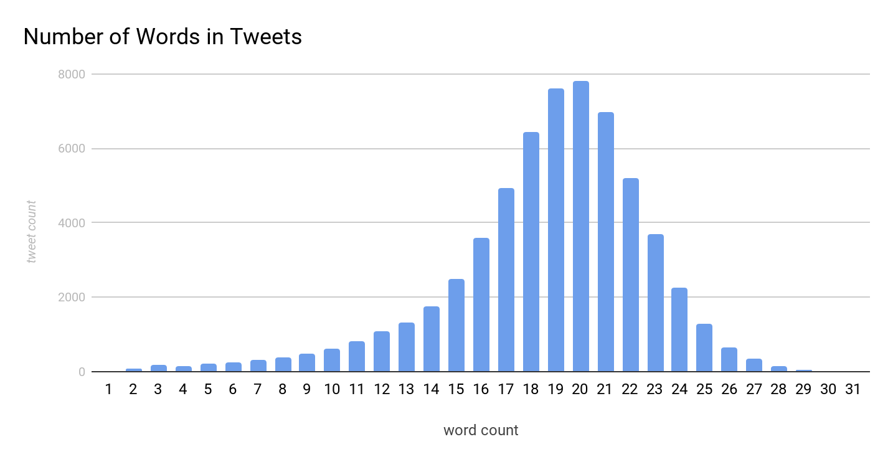
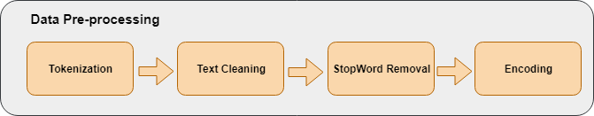
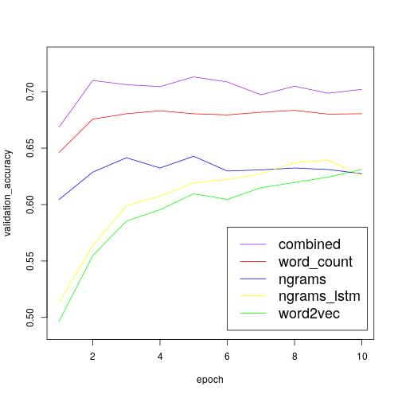
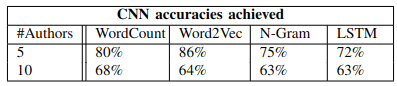

# DeepLearning_Project
Due to the recent rise of fake news and plagiarism found in social media, authorship attribution is considered a growing area in the field of natural language processing and deep learning. Compared to the task of identifying plagiarism found in books or research papers, identifying the author of a Twitter message is more difficult because of the inherent small size of a Twitter post and its overall lack of grammatical structure. This paper proposes a deep convolutional neural network which can correctly identify the author of a given Twitter message. In addition, we apply several well-known natural language processing techniques that utilize lexical, syntactical, and semantic features in order to classify a twitter post. Unlike other previously proposed methods in the literature which rely on complex recurrent neural networks, we demonstrate that a simple convolutional neural network can achieve quite astonishing results.

## Introduction

While there are many different techniques used for authorship attribution and document classification, most of the research done in natural language processing points to three main methods: the bag-of-words model (BoW), word embeddings, and character n-grams. Many of the approaches found in the literature make use of one of these methods by either utilizing a slight variation of one of them or even sometimes combining them together. All methods essentially extract features from the given text in order to classify the correct author. Compared to word embeddings and character n-grams, the BoW model tends to be the easiest to implement and use. The BoW model relies mainly on the word count and term frequency while completely ignoring the sequential order in which each word appears. Generally, the method for BoW is first to split all words into so-called tokens and then convert them into a feature vector for each sentence using one-hot encoding. 
On the other hand, word embedding takes into account the sequential word order found in each sentence. More specifically, it focuses on the underlying structure of each sentence and identifies similarities in syntactical patterns. Each word is essentially mapped to a vector or real number. Although there are many methods for representing each word as a vector, the most popular is word2vec. Word2Vec relies on the assumption that two words who share similar contexts also share similar meanings, and therefore a similar vector representation. For a more detailed description of how we applied word2Vec to our model, see the section titled training.

The third major technique we used in our experiments was the character n-gram method. Character n-grams are used to detect the morphological makeup of a given word. That is, they discover stylistic features of a word or character found in a text. For example, when a word is misspelled or a unique character is used, character n-grams are helpful by using these features to characterize a given text.

As part of this paper, we will demonstrate that there is in fact no silver bullet or one size fits all approach and that all methods have their inherent strengths and weaknesses. The structure of this paper will be as follows: In the first section following the introduction, we will briefly discuss the dataset used and how we collected the data directly from Twitter. In the following two sections, we will talk about the data pre-processing techniques which we used and then our process for learning various features. In the latter section, we will also present the main architectures that we tried out. The next section will deal with the respective results that we achieved while comparing each method with one another. Lastly, we will discuss our results and conclude with a summary and short expose on future and related works.  
## Dataset
Because there were no publicly available Twitter datasets used for authorship attribution, we created and collected our own dataset using the Twitter API and a custom python script to mine all Twitter posts from public accounts. In addition, we also accessed an existing dataset with tweets from U.S. politicians where we reorganized and filtered the existing dataset to a format that's usable for our task. The main reason for using an existing dataset is that the Twitter API limits the tweets that are downloadable per account to only 3200. To download more than the most recent 3200 tweets, a paid subscription is needed. Together with the 3200 tweets per user from the existing dataset, we were able to obtain approximately 6400 tweets per user. The dataset was mined from 10 different user accounts which were publicly available and all Twitter accounts belonged to U.S. politicians. Overall, we collected slightly more then 64.000 tweets. In order to avoid over-fitting and correctly validate our model, our dataset was split into three parts: a training corpus (approx. 40,000 Tweets), validation set (approx. 10,000 Tweets), and a test set (approx. 10,000 Tweets).
Most tweets in our dataset contained between 16 and 23 words. The whole dataset has the distribution shown in the figure below:

The data pre-processing step turned out to be a crucial part of our projects success. When comparing text from a Twitter post to that of a book or novel, there are various random characters such as hash tags, "$@$" symbols, and other characters such as emojis. In the process of training our models, we encountered different trade-offs when considering which characters to keep or remove. We found that oftentimes, removing seemingly useless characters decreased the accuracy where as removing stop-words (i.e. words such as "the", "a" "and", and "is") made little to no difference at all. We also discovered that when using different architectures, different pre-processing techniques tend to be more suitable than others. For example, with the character n-grams approach, the removal of special characters like emojis had a negative impact on the results, but for the word2vector approach, it had a more positive effect on the accuracy.
For all of our approaches, URLs and very short tweets (i.e. Tweet $< 15$ characters) were removed from the dataset. We found it useless to analyze an URL, because the account owner is not really the author of the URL. Furthermore, short Tweets simply do not contain enough data to analyze anything.

For our implementation of the bag-of-words approach, we used the keras tokenizer. The tokenizer made it very easy to convert our input data into a simple vector via one hot encoding. The resulting one hot encoded vector was then passed into the simple fully connected neural network with 2 hidden layers. Because we had issues with over-fitting, dropout was required for regularization to counteract over-fitting and better generalize. In the end, it made no difference whether we used binary encoding or the actual frequency of each word. This can be partially explained by the fact that tweets are relatively short in length and instances where a given word occurs more than once within a single tweet are very rare. In general, the bag-of-words model delivered quite modest results for 5 classes ($80\%$) but the accuracy drastically decreased for 10 classes ($68\%$) as shown in the results section. 

For the word embedding approach, we also used the keras tokenizer which is able to generate word sequences represented by integers for a given input sentence. These sequences were then padded with zeros to get a consistent length across the input data. The padded sequences were then passed onto two separate embedding layers. The embedding matrix for one of these layers was generated using the gensim package which generates the matrix based on a distance calculated using the word occurrences found in the text. This embedding layer was set to non trainable. The other embedding layer was initialized with random values which were in fact trainable. The second trainable embedding layer was added due to the not so good results with the trainable one. We believe that the reason for this is that short texts makes it very difficult to get an actual distance between each pair of words. We achieved the best results when combining these two embedding layers. The output of both embedding layers was concatenated and passed into several convolutional and max pooling layers.

Compared to the other methods, n-grams is the only approach which extracts stylistic features such as punctuation. Character n-grams are groups of n characters. They are represented by calculating an integer value that uniquely identifies that particular n-gram. The integers are calculated as follows:
Let $z$ be the total number of characters. Let $x = (c_1, c_2, ..., c_n)$ be the n-gram where $c_1, ..., c_n$ are characters represented by a unique number between $0$ and $z$. Then the integer representing the n-gram is equal to $f_n(x)$, where $f_y(x) = f_{y-1}(x) \cdot z + c_y$ and $f_1(x) = c_1$.
After transforming the tweets to n-grams, they were passed into an embedding layer which was initialized randomly. Similar to the authors Shrestha et. al, the output of this embedding layer was passed to three independent convolutional layers with respective kernel sizes 3, 4 and 5 \cite{shrestha-etal-2017-convolutional}. The output of each layer is passed to a max pooling layer and the results are concatenated and a final dense layer compresses the result down to the expected number of classes. 
Due to memory limitations, only n-grams with a size of $n \le 3$ were tested. $n = 2$ seems to deliver the best results.

Combination of Bag-of-Words, Word Embedding and N-grams
The last approach we tried out was to combine all methods together into one model in order to extract all stylistic aspects including punctuation, words an author uses, and the order in which he/she uses words. This model gave us the best results with about 72\% accuracy for 10 classes. A comparison of all models can be seen in figure 

As one can see in figure \ref{fig:val_acc} above, each method achieves quite different results by itself. What stands out the most is the n-grams method. It achieves quite bad results in the beginning of training, however, it's accuracy seems to grow quite fast until reaching epoch 5 and then it plateaus like the other methods. In contrast to n-grams, the other methods reach a level of accuracy and then level off very quickly. This is probably mostly due to the fact that n-grams are passed into an embedding layer which is initialized randomly. Another quite astonishing result shown in the graph is that using only word counts achieves better results than only using word2vec. This is interesting because word2vec is often said in the literature to be a very good technique for classifying text. We believe the reason for why word count outperforms word2vec here, specifically in the context of Twitter posts, is the fact that there are not so many sequential features to extract. Twitter authors don't always use complete sentences and sometimes only use a list of words for a single post. \\

As previously mentioned, there seems to be no one single method which seems to work best when tackling the task of identifying the correct author of a given Twitter post. Indeed, after carrying out various tests and reading through some of the literature, we discovered that if the average training example is small and context is domain specific, BoW appears to work better than more complex methods like n-grams.\cite{wordEmbedding}. In other words, context is very domain specific which means that one cannot find corresponding vectors from pre-trained word embedding models. In this way, our results confirm what the literature shows is also the case.

In general, utilizing and combining all stylistic and syntactical techniques at hand produces the best results. But the fact that for more classes all techniques perform about the same indicates that there is just not enough information in a short text like a tweet to get better results. This is also indicated by the fact that our accuracy is close to the ones mentioned in other papers.
For future projects it might be a good idea to include meta-data like the time or the geo-location that comes with the tweet, but in this project we wanted to focus only on the plain text.
